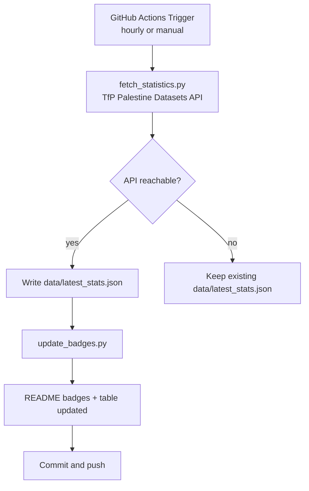

# Gaza Genocide Documentation - Project Structure

## 📁 Complete Project Structure

```
Gaza-Genocide/
├── README.md                          # Main documentation with dynamic badges
├── CONTRIBUTING.md                    # Contribution guidelines
├── PROJECT_STRUCTURE.md               # This file - project documentation
├── DEPLOYMENT_GUIDE.md                # Deployment instructions
├── requirements.txt                   # Python dependencies
├── fetch_statistics.py                # Main data fetching script (repo root)
├── .github/workflows/
│   └── update-stats.yml              # GitHub Actions for hourly updates
├── scripts/
│   └── update_badges.py              # Badge + table update script
└── data/
    └── latest_stats.json             # Current statistics (auto-generated)
```

## 🔧 Core Components

### 1. Data Fetching System (`fetch_statistics.py`)

**Purpose**: Fetches the latest verified statistics from a real, machine-readable source.

**Data Source**: the [Tech for Palestine "Palestine Datasets" API](https://data.techforpalestine.org)
- Endpoint: `https://data.techforpalestine.org/api/v3/summary.json`
- Updated daily from the Gaza Ministry of Health daily reports, cross-referenced with UN OCHA
- Provides cumulative totals for Gaza: killed (total / children / women / press / medical / civil defence), injured, massacres
- Also covers the West Bank, Lebanon, and the known-by-name victim list

**Key Features**:
- No estimates or extrapolation — only published figures
- Sanity checks on the API payload before accepting it
- Fallback: if the API is unreachable, the previously saved `data/latest_stats.json` is kept untouched
- Figures not exposed by the API (displacement, hospital functionality, food insecurity) are manually-maintained constants in `MANUAL_FIGURES`, sourced from UN OCHA flash updates

### 2. Badge Update System (`scripts/update_badges.py`)

**Purpose**: Updates README badges and the live statistics table with the latest numbers.

**Key Features**:
- Reads `data/latest_stats.json` and creates shields.io badge URLs
- Updates the badge row and the "LIVE STATISTICS TABLE" in README.md
- Updates the "Last Updated" timestamp
- Warns if an expected badge or table row is not found

**Badges**:
- Death Toll (red)
- Children Killed (orange)
- Women Killed (purple)
- Injured (yellow)
- Displaced (blue)
- Hospitals Operational (green)
- Last Updated (blue)

### 3. GitHub Actions Workflow (`.github/workflows/update-stats.yml`)

**Purpose**: Automated hourly updates.

**Schedule**: Runs every hour (`17 * * * *`), plus manual `workflow_dispatch`.

**Steps**:
1. Checkout repository
2. Set up Python 3.11
3. Install dependencies from `requirements.txt`
4. Fetch latest statistics (`python fetch_statistics.py`)
5. Update README badges (`python scripts/update_badges.py`)
6. Commit and push changes (only if data or README changed)

**Permissions**: `contents: write` using the default `GITHUB_TOKEN` — no PAT needed.

## 📊 Data Structure

### Statistics JSON Format (`data/latest_stats.json`)

```json
{
  "total_deaths": "74,016+",
  "children_deaths": "20,179+",
  "women_deaths": "12,500+",
  "total_injured": "175,068+",
  "press_killed": "262+",
  "medical_staff_killed": "1,701+",
  "civil_defence_killed": "140+",
  "massacres": "12,000+",
  "displaced_people": "1.9M+",
  "operational_hospitals": "15/36",
  "food_insecurity": "93%",
  "water_access": "15%",
  "west_bank_killed": "1,123+",
  "west_bank_children_killed": "240+",
  "known_named_victims": "72,835+",
  "last_data_update": "2026-09-26",
  "last_updated": "2026-09-27 12:51 UTC",
  "days_of_conflict": 1086,
  "fetch_timestamp": "2026-09-27T12:51:29.868386",
  "source": "Tech for Palestine - Palestine Datasets (Gaza MoH / UN OCHA)",
  "source_url": "https://data.techforpalestine.org/api/v3/summary.json",
  "update_frequency": "hourly",
  "data_verification": "cross-referenced by Tech for Palestine"
}
```

## 🚀 Deployment

The project runs entirely on GitHub:

- GitHub Actions handles hourly automation
- GitHub renders the README with the updated badges
- Zero hosting costs, zero infrastructure

See `DEPLOYMENT_GUIDE.md` for the exact steps.

## 🔄 Automation Flow



## 🛠️ Development Setup

### Prerequisites
- Python 3.8+
- Git

### Local Development
```bash
# Clone repository
git clone https://github.com/SharifDer/Gaza-Genocide.git
cd Gaza-Genocide

# Install dependencies
pip install -r requirements.txt

# Fetch latest statistics
python fetch_statistics.py

# Update README badges and table
python scripts/update_badges.py
```

### Testing
```bash
# Verify data structure
cat data/latest_stats.json

# Check badge updates
python scripts/update_badges.py

# Verify README was updated
git diff README.md
```

## 🔍 Monitoring and Maintenance

### Health Checks
- GitHub Actions workflow status (Actions tab)
- Data source availability: https://data.techforpalestine.org
- Badge update frequency (commit history)

### Error Handling
- API unreachable → keep last good data, workflow succeeds without changes
- Implausible API payload → rejected by sanity check, last good data kept
- Missing badge/table row in README → warning printed, no crash

### Manual Figures
Displacement, hospital, and food-insecurity figures are not available via the
API. They are maintained manually in `MANUAL_FIGURES` inside
`fetch_statistics.py`, sourced from [UN OCHA flash updates](https://www.ochaopt.org/).
Update them when OCHA publishes new figures.

## 📞 Support and Contributing

- GitHub Issues for bug reports
- CONTRIBUTING.md for guidelines
- Data corrections: check the source first at https://data.techforpalestine.org

---

**This project is a fully automated documentation system for the humanitarian crisis in Gaza, powered by real, verified data.**
